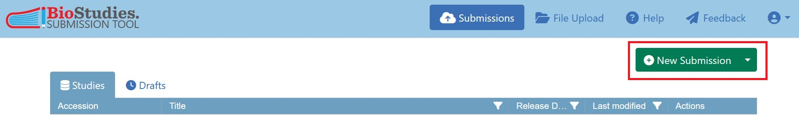
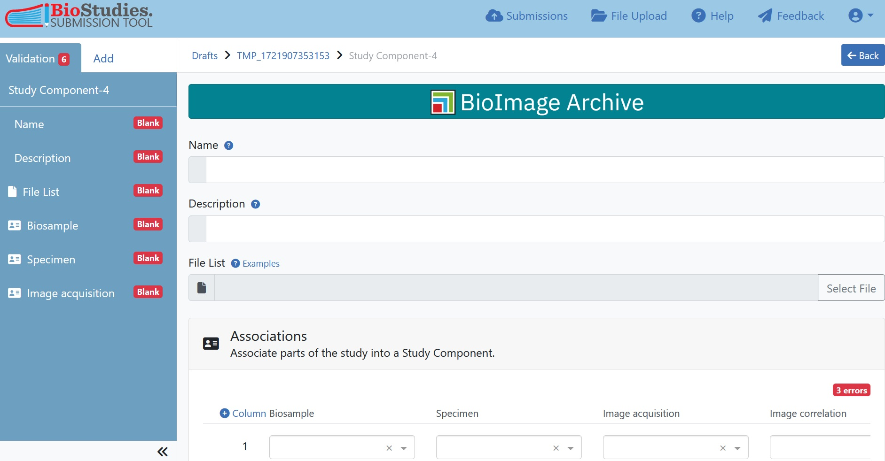

# FAIR Data 101 - Depositing bioimage data in the BioImage Archive


[![CC BY 4.0][cc-by-shield]][cc-by]


**Author**: Isabel Kemmer ([ORCID](https://orcid.org/0000-0002-8799-4671)), Euro-BioImaging ERIC ([ROR](https://ror.org/05d78xc36))

## Overview

This is the material for the workshop #18 'FAIR Data 101: Depositing BioImage Data in Open Repositories' held at [Trends in Microscopy 2025](https://gerbi-gmb.de/event/tim2025/). 

In this hands-on tutorial we will learn how to submit data to the [BioImage Archive](https://www.ebi.ac.uk/bioimage-archive/). This document should accompany the slides to keep track of the action steps and tasks and to follow the live presentation. 

This tutorial is based on this [recipe](https://faircookbook.elixir-europe.org/content/recipes/applied-examples/BIA_submission.html) from the FAIRcookbook which describes the full submission process to BioImage Archive on a real-life example. This recipe provides a more complete picture of the BioImage Archive submission process and more detailed background information.


## Materials

:clipboard:  We will demonstrate the data submission process to BioImage Archive using the following real-world paper as an example:

```
Dynamic multi-omics and mechanistic modeling approach uncovers novel mechanisms of kidney fibrosis progression

Nadine Tuechler, Mira Lea Burtscher, Martin Garrido-Rodriguez, Muzamil Majid Khan, Denes Türei, Christian Tischer, Sarah Kaspar, Jennifer Jasmin Schwarz, Frank Stein, Mandy Rettel, Rafael Kramann, Mikhail M Savitski, Julio Saez-Rodriguez, Rainer Pepperkok

bioRxiv 2024.10.15.618507; doi: https://doi.org/10.1101/2024.10.15.618507 
```

:page_facing_up: Since this paper contains also other types of data, we will be working with this [reduced version](shortened_paper.pdf) of the paper which only contains the parts relevant for imaging.

:microscope: We will be working with a small subset of the images generated in the study that you can find in the TiM2025 OMERO.


## BioImage Archive submission process


The BioImage Archive submission process is roughly represented by the following 6 steps:


with the following sub-steps:


:globe_with_meridians: More information on the [BioImage Archive submission](https://www.ebi.ac.uk/biostudies/submissions/)

## 1: Create an account

For this workshop we will be working on the **BioImage Archive DEV server**. This will resemble the actual submission interface, but submissions will not be displayed on the web page. Here we can play around and submit data that is not necessarily in-scope. 

| :pencil2:  **TASK**       |
|:--------------------------|
|:arrow_forward: **Create yourself an account on the BioStudies DEV server** |

>[!NOTE]
> For running other trainings or similar you are able to request the link to the BioImage Archive DEV server. Please [contact](https://www.ebi.ac.uk/bioimage-archive/contact-us/) the Archive directly.


> [!IMPORTANT]  
> If you actually want to submit a dataset for public access you will need to create a new account on the [real submission system](https://www.ebi.ac.uk/biostudies/submissions/#/signup). There, please do **NOT submit this example data** and make sure that you only submit data that is within the [scope](https://www.ebi.ac.uk/bioimage-archive/scope/) of the BioImage Archive. Please also comply to the BioImage Archive [policies](https://www.ebi.ac.uk/bioimage-archive/help-policies/) before submitting actual data.


## 2: Organizing data

For the submission all data files (including raw and processed images) are organized in one or several folders with subfolders following a logical and hierarchical structure. 

BioImage Archive uses [REMBI](https://www.nature.com/articles/s41592-021-01166-8) as the underlying metadata model, which also influences the data organization.


The best practice is to create one folder per Study Component (i.e. grouping of experimental units). A submission can contain one or more Study Components. 

> [!NOTE]  
> The file paths will not be visible on the submission page, only the file names. For this reason, if the directory structure contains metadata, include this information in the File-List (see below).


### Study components

Here are some examples for different study types and how they could be represented in Study Components: 


Here is an example of a real-life dataset and how the Study Components are designed:


:globe_with_meridians: [Further Study Component Examples](https://www.ebi.ac.uk/bioimage-archive/rembi-help-examples/)

BioImage Archive offers a lot of freedom in terms of how to structure your submissions BUT a lot of freedom means a lot of decisions! Be aware of the ['paradox of choice' or 'choice overload'](https://en.wikipedia.org/wiki/Overchoice). 


| :pencil2:  **TASKS**       |
|:--------------------------|
|:arrow_forward: **Understand the data composition of the paper** |
|:arrow_forward: **Design the Study Components**|
|:arrow_forward: **Check if the data organization matches the planned Study Components, if not reorganize the data**|


## 3: Uploading Data

Through the submission interface, a 'secret directory' will be created for each user as a place to upload their data prior to submission.

>[!NOTE]
>The secret directory is not intended for long-term storage of your data and will be deleted after 3 months.


| :pencil2:  **TASK**       |
|:--------------------------|
|:arrow_forward: **Upload each Study Component folder over the portal** |


Several data upload methods are available and different methods are recommended for different data size ranges: 

|Size|Submission Method|
|--- |--- |
|less than 50 GB total size & <br> less than 20 GB per individual file|Submission tool upload|
|up to 1 TB total size|FTP|
|larger than 1 TB|Aspera|

Help and credentials for FTP and Aspera upload can be found at the FTP/Aspera Button.


## 4: Create the submission

| :pencil2:  **TASK**       |
|:--------------------------|
|:arrow_forward: **Initialize a new BioImage Archive submission** |





### 4.1 Input Metadata

| :pencil2:  **TASK**       |
|:--------------------------|
|:arrow_forward: **Fill-in the study-level metadata** |
|:arrow_forward: **Fill-in the 'Study Component' section, but leave the File-List and associations empty** |
|:arrow_forward: **Fill-in the experimental metadata (i.e. REMBI components) for this first Study Component** |





> [!TIP]
> - If a particular item is not available in the dropdown menu, you can enter free text there instead.
> - The study persons refer to people involved in image data generation, analysis and submission and do not have to be the same as the authors of the corresponding paper
> - Associate people with their OCRID if possible
> - Link to other deposited resources (analysis code, other data types)
> - Try to include controlled vocabulary terms from suitable ontologies (i.e. found through the [ontology look-up service](https://www.ebi.ac.uk/ols4)). 


### 4.2 Duplicate Study Components

If the record contains multiple Study Components and/or multiple variants of REMBI components, it is important to ensure that this organisation is properly reflected in the submission interface.

To add components click on “add” in the top left corner and select the section to duplicate. This will give another blank copy of the selected component.

| :pencil2:  **TASK**       |
|:--------------------------|
|:arrow_forward: **Duplicate certain REMBI modules for the second Study Component**|
|:arrow_forward: **Fill-in the experimental metadata for the REMBI modules of the second Study Component** |


### 4.3 Associate Study Components

Now we need to associate which of the REMBI modules belongs to which Study Component.

| :pencil2:  **TASK**       |
|:--------------------------|
|:arrow_forward: **Associate the REMBI components to the respective Study Components** |

Again, leave the ‚File-List‘ empty for now. We will be generating the File-Lists in the next step.


## 5: Generate the File-List

One of the key elements of a BioImage Archive submission is the File-List, which lists each file in the submission and associates it with file-level metadata.


File-List Basics:

- „Table of content“ of each file included in each study component (i.e. one File-List per Study Component)

- Table-format file 

- The first column lists the file names and their relative paths, further columns will then detail the file-level metadata

Technical Details:

- File-Format: tab-delimited (.tsv, .xlsx)
- First column is named 'Files'

- One row per file

- include only attributes that have at least two distinct values for the set of image files

- Do not leave blank lines/cells


> [!TIP]  
> It is also possible to have a File-list that collects files from a number of different folders, as may be necessary if a Study Component is not inside a single folder but spread across multiple folders.

:globe_with_meridians: [File-list Help](https://www.ebi.ac.uk/bioimage-archive/help-file-list/)


### 5.1 Download the File-list Template

When all data is uploaded, the File-list template(s) can be automatically generated over the file upload portal. 

| :pencil2:  **TASK**       |
|:--------------------------|
|:arrow_forward: **Download the File-List templates for each Study Component** |


### 5.2 Populate the File-List

Once you have downloaded the empty File-lists, you need to locally edit the File-list to include additional columns describing file-level metadata.

> [!IMPORTANT]  
> This submission tool only generates a File-list with a single column listing all files (recursively, i.e. all files in all subdirectories) and their paths, but no suggestions for additional metadata columns.

| :pencil2:  **TASK**       |
|:--------------------------|
|:arrow_forward: **Open the File-Lists and insert descriptive columns. Add values for each image.** |


### 5.3 File-list associations

| :pencil2:  **TASK**       |
|:--------------------------|
|:arrow_forward: **Upload the File-Lists over 'File Upload'** |
|:arrow_forward: **Associate each File-List to the corresponding Study Component** |


## 6: Sumbit

After you submit the entry, all data is loaded from the secret-directory into the BioImage Archive database. There it will be processed and assigned a unique identifier as well as a crossref DOI.

> [!CAUTION]
> Before submitting this workshops data, please check that you are working on the DEV server. 

>[!WARNING]
> If you are logged into the actual submission interface, please note that it is the responsibility of the submitter to **ensure that they have the right to submit the data**, as the information displayed on the BioImage Archive and BioStudies websites is fully disclosed to the public and all datasets submitted to the BioImage Archive will remain permanently accessible as part of the scientific record.
> Please be sure to comply to the [BioImage Archive policies](https://www.ebi.ac.uk/bioimage-archive/help-policies/) when submitting anything. 


| :pencil2:  **TASK**       |
|:--------------------------|
|:arrow_forward: **Check all data and once everything is correct click the ‚submit‘-button** |
|:arrow_forward: **Inspect the resulting submission** |


After the dataset is public each author can claim the dataset to their ORCID:


> [!IMPORTANT]
> On the DEV instance no DOI will be assigned and the resulting entry will not be public. Also, since we are only submitting to the DEV instance and not generating a real entry, do not try to claim this entry.


## Annotations

Annotations (i.e. segmentation masks, labels, bounding boxes) can be deposited in BioImage Archive according to MIFA: Metadata, Incentives, Formats, and Accessibility guidelines which were designed to improve the reuse of AI datasets for bioimage analysis.

:globe_with_meridians: [MIFA-paper](https://doi.org/10.48550/arXiv.2311.10443)

:globe_with_meridians: [MIFA implementation in BioImage Archive](https://www.ebi.ac.uk/bioimage-archive/mifa-overview/)


## Further Links

<details>
<summary>Do you want to dig deeper?</summary>
Here is a non-exhaustive list of further information about BioImage Archive:

:globe_with_meridians:  [REMBI models of BioImage Archive](https://github.com/BioImage-Archive/bia-rembi-models)

:globe_with_meridians:  [Submitting OME-Zarr data to BioImage Archive](https://www.ebi.ac.uk/bioimage-archive/help-zarr)

:globe_with_meridians:  [BIA-agent: python package for BIA submissions](https://github.com/BioImage-Archive/bia-agent)


</details>

***

## License and Funding

[![CC BY 4.0][cc-by-image]][cc-by] This work is licensed under a
[Creative Commons Attribution 4.0 International License][cc-by]. 

[cc-by]: http://creativecommons.org/licenses/by/4.0/
[cc-by-image]: https://i.creativecommons.org/l/by/4.0/88x31.png
[cc-by-shield]: https://img.shields.io/badge/License-CC%20BY%204.0-lightgrey.svg


This work is supported by the EU in the frame of the [EVOLVE](https://www.eurobioimaging.eu/evolve/) project (Grant: 101130986).


